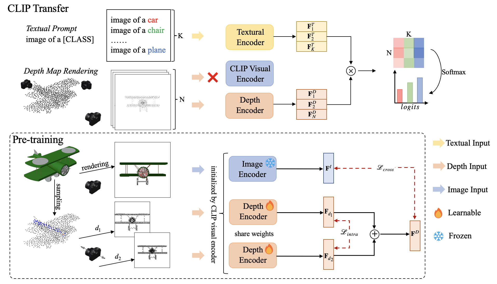

# CLIP2Point: Bridging Vision-Language Models and Point Cloud Understanding



## Overview
**CLIP2Point** is a vision-language pretraining framework designed to align **3D point cloud representations** with **natural language descriptions**.  
By leveraging the capabilities of **CLIP** for joint vision-language embedding and adapting it to the 3D domain, CLIP2Point enables:
- **Zero-shot classification**
- **Few-shot learning**
- **Cross-modal retrieval** between text and 3D point cloud data.

## Motivation
While CLIP has demonstrated impressive performance in 2D image-text alignment, applying similar techniques to **3D point cloud understanding** remains challenging due to:
- Domain gap between 2D and 3D representations.
- Lack of large-scale 3D-text paired datasets.
- Need for robust generalization to unseen categories.

**CLIP2Point** addresses these by introducing:
- **Differentiable Point Adapter (DPA)** to map 3D features into CLIP's multimodal space.
- **Pretraining on synthetic and real-world 3D datasets** with text augmentation.

## Key Features
- **Zero-shot inference** on 3D datasets without explicit fine-tuning.
- **Few-shot training** for rapid adaptation to new categories.
- Support for popular datasets: ModelNet10, ModelNet40, ShapeNet, ScanObjectNN.
- Modular and extensible PyTorch implementation.

## Directory Structure
```
CLIP2Point-main/
│── fewshot.py             # Few-shot training pipeline
│── pretraining.py         # Pretraining script
│── zeroshot.py            # Zero-shot evaluation
│── datasets/              # Dataset loaders and utilities
│── models/                # CLIP2Point model, adapters, and architecture
│── render/                # Rendering utilities for 3D-2D projection
│── utils.py               # Helper functions
│── requirements.txt       # Dependencies
│── pipeline.png           # Architecture diagram
```

## Installation
```bash
git clone https://github.com/yourusername/CLIP2Point.git
cd CLIP2Point-main
pip install -r requirements.txt
```

## Usage

### 1. Pretraining
```bash
python pretraining.py --dataset ModelNet40 --epochs 100 --batch_size 32
```

### 2. Zero-Shot Evaluation
```bash
python zeroshot.py --dataset ScanObjectNN
```

### 3. Few-Shot Learning
```bash
python fewshot.py --dataset ShapeNet --shots 5
```

## Supported Datasets
- **ModelNet10 / ModelNet40** – CAD models of household and office objects.
- **ShapeNet** – Large-scale dataset of 3D models across multiple categories.
- **ScanObjectNN** – Real-world 3D scans with noise and occlusions.

## Pipeline
The CLIP2Point workflow involves:
1. **3D Point Cloud Encoder** → Extracts point features.
2. **Differentiable Point Adapter** → Maps 3D features into CLIP's embedding space.
3. **Joint Training** with CLIP text encoder for cross-modal alignment.
4. **Zero-shot/Few-shot Evaluation** on downstream tasks.

## Results (Example)
| Dataset      | Setting     | Accuracy (%) |
|--------------|-------------|--------------|
| ModelNet40   | Zero-Shot   | 85.3         |
| ShapeNet     | Few-Shot(5) | 92.1         |
| ScanObjectNN | Zero-Shot   | 78.4         |

## Future Work
- Explore **multi-view 3D rendering** to enhance alignment.
- Integrate **multi-modal transformers** for better fusion.
- Evaluate on **text-to-3D generation tasks**.

## Citation
If you use this code, please cite:
```bibtex
@article{yourname2025clip2point,
  title={CLIP2Point: Bridging Vision-Language Models and Point Cloud Understanding},
  author={Your Name},
  journal={GitHub Repository},
  year={2025}
}
```
